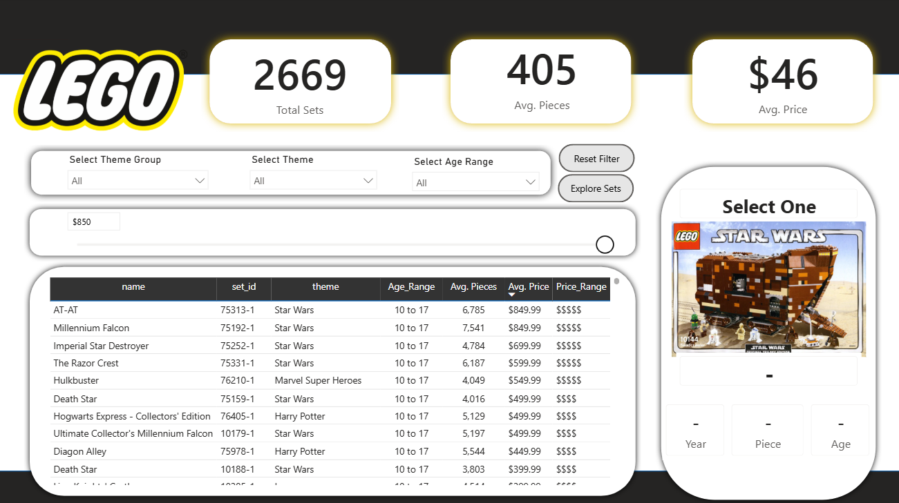
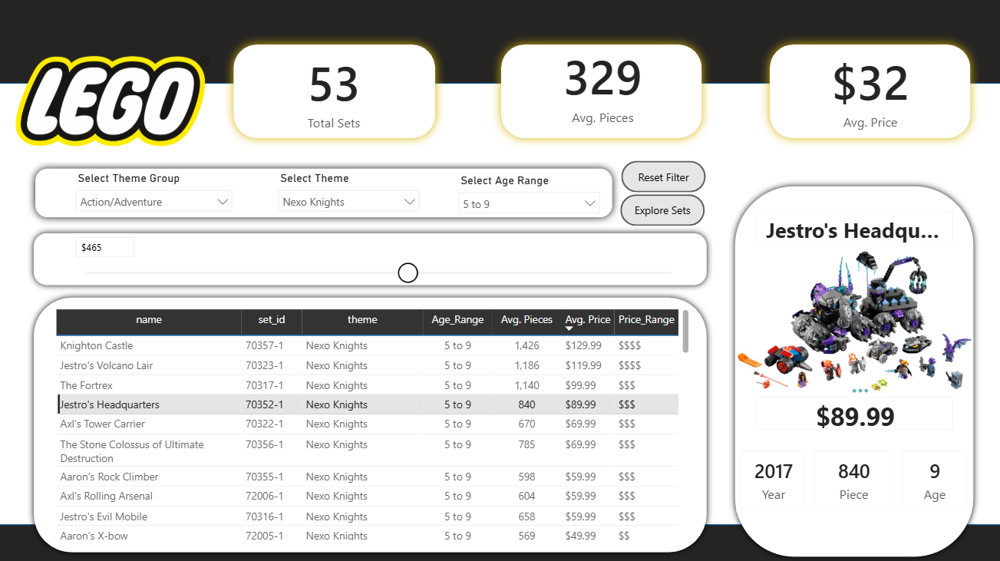
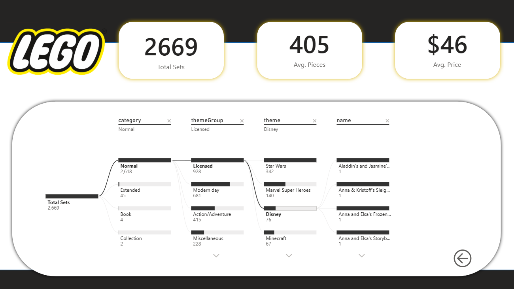
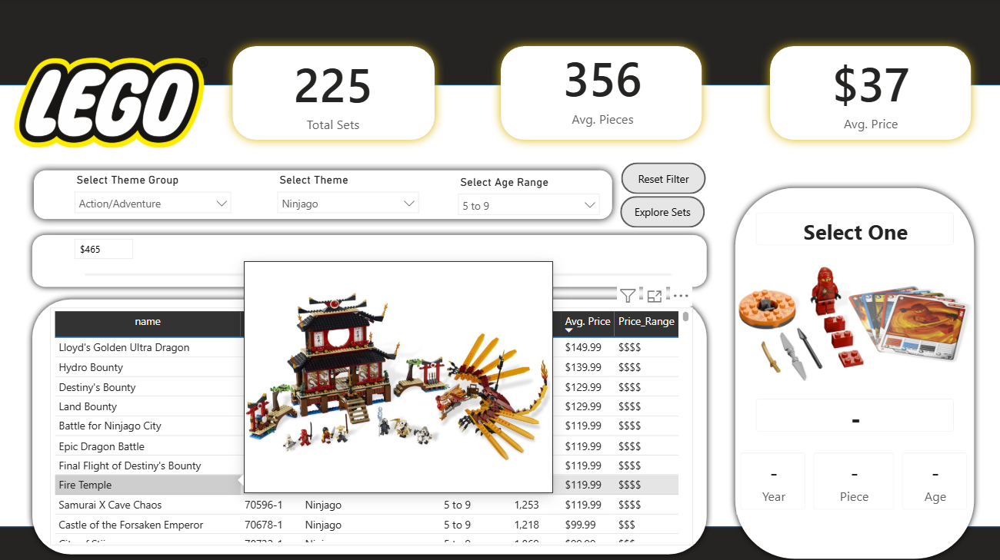

# LEGO Sets Business Analytics Dashboard

## Overview

This project is an interactive **Power BI Business Analytics Dashboard** developed to analyze **2,669 LEGO sets released between 1970 and 2022**. Starting with a raw CSV dataset, the project involved data cleaning, transformation, data modeling, DAX calculations, and dashboard development to create an engaging and user-friendly analytical solution.

The dashboard enables users to explore LEGO products by theme, price, age group, and number of pieces while providing dynamic filtering, interactive tooltips, and drill-down analysis for better decision-making.

---

## Business Problem

With thousands of LEGO sets released over several decades, it becomes challenging to identify pricing trends, compare themes, analyze product characteristics, and explore individual sets efficiently.

This dashboard addresses these challenges by transforming raw product data into an interactive business intelligence solution that allows users to:

- Explore LEGO sets across different themes and age groups.
- Analyze pricing and piece-count distributions.
- Filter products dynamically using interactive slicers.
- View product images instantly through hover tooltips.
- Drill down from category to individual sets using a decomposition tree.
---

## Dataset

The dashboard is built using a CSV dataset containing information on LEGO sets released between **1970 and 2022**.

### Dataset includes:

- Set Name
- Set ID
- Release Year
- Theme
- Theme Group
- Category
- Number of Pieces
- Recommended Age
- Retail Price
- Product Image URL

The dataset was imported into Power BI and transformed using **Power Query** before analysis.

---

## Project Objectives

The primary objective of this project was to transform raw LEGO product data into an interactive business intelligence dashboard that enables users to explore product trends, pricing, themes, and customer segments.

The dashboard was designed to answer questions such as:

- How many LEGO sets have been released since 1970?
- Is there a relationship between a set's price and its number of pieces?
- Which LEGO themes are the most common?
- How are products distributed across different age groups?
- Which sets belong to premium price categories?

---

## Data Cleaning & Transformation

The raw CSV dataset was cleaned and prepared using **Power Query** before creating the report.

### Data preparation steps

- Imported the raw LEGO CSV dataset into Power BI.
- Removed unnecessary columns (`minifigs`, `bricksetURL`, and `thumbnailURL`).
- Verified and corrected data types where required.
- Filtered out records with missing values for:
  - Price
  - Number of Pieces
  - Recommended Age
  - Product Image URL
- Created custom **Age Range** categories:
  - 1–4
  - 5–9
  - 10–17
  - Over 18
- Created custom **Price Range** categories:
  - $
  - $$
  - $$$
  - $$$$
  - $$$$$

These transformations ensured that the dataset was clean, consistent, and ready for analysis.

---

## DAX Measures

The following DAX measures were created to support interactive reporting:

- Total Sets
- Total Theme Groups
- Average Price
- Average Pieces
- Average Age

These measures drive the KPI cards and provide dynamic calculations based on user-selected filters.
---

## Dashboard Features

The dashboard was designed to provide an intuitive and interactive experience, allowing users to explore LEGO sets from multiple perspectives.

### 📊 KPI Dashboard

The report includes dynamic KPI cards displaying:

- Total LEGO Sets
- Average Price
- Average Pieces

These KPIs automatically update based on the selected filters.

---

### 🎯 Interactive Filters

Users can filter the dashboard using:

- Theme Group
- Theme
- Age Range
- Maximum Price (What-If Parameter)

These filters enable quick exploration of specific product categories and customer segments.

---

### 📋 LEGO Set Explorer

An interactive table allows users to browse LEGO sets while displaying:

- Set Name
- Set ID
- Theme
- Age Range
- Average Pieces
- Average Price
- Price Range

Selecting a row dynamically updates the product details section.

---

### 🖼️ Product Details Panel

The dashboard includes a dedicated details section that displays information for the selected LEGO set, including:

- Product Image
- Set Name
- Release Year
- Retail Price
- Number of Pieces
- Recommended Age

This provides users with a quick overview without leaving the report.

---

### 💡 Interactive Image Tooltips

One of the key features of this dashboard is the use of **custom report tooltips**.

When users hover over a LEGO set in the table, an image of the selected product is displayed instantly, making product exploration faster and more intuitive.

---

### 🔄 Reset Filters

A bookmark and button action were implemented to allow users to reset all report filters with a single click, improving usability and navigation.

---

### 🌳 Decomposition Tree Analysis

A dedicated report page includes a **Decomposition Tree** that enables users to drill down through the data hierarchy:

**Category → Theme Group → Theme → Individual LEGO Set**

This helps users identify trends and explore product distributions at different levels of detail.
---

## Key Insights

Using the interactive dashboard, users can:

- Analyze LEGO set releases across more than five decades.
- Compare retail prices with the number of pieces to identify pricing patterns.
- Explore product distribution across different age groups.
- Identify the most common LEGO themes and theme groups.
- Filter products dynamically based on customer preferences and budget.
- Drill down from high-level categories to individual LEGO sets for detailed analysis.

---

## Tech Stack

| Category | Tools Used |
|----------|------------|
| Business Intelligence | Power BI |
| Data Transformation | Power Query |
| Data Analysis | DAX |
| Data Source | CSV Dataset |
| Data Visualization | Power BI Visuals |
| Interactive Features | Slicers, Tooltips, Bookmarks, Buttons, Decomposition Tree |

---

## Skills Demonstrated

- Business Analytics
- Data Cleaning
- Data Transformation
- Data Modeling
- Power Query
- DAX
- KPI Development
- Dashboard Design
- Interactive Reporting
- Data Visualization
- Business Intelligence
- Analytical Thinking
---

# Dashboard Preview

## Dashboard Overview



---

## Set Explorer



---

## Decomposition Tree Analysis



---

## Interactive Tooltip Preview


---

# Repository Structure

```text
lego-sets-business-analytics-dashboard
│
├── Dashboard
│   └── LEGO Sets Dashboard.pbix
│
├── Dataset
│   └── lego_sets.csv
│
├── Images
│   ├── dashboard-overview.png
│   ├── set-explorer.png
│   ├── decomposition-tree.png
│   └── tooltip-demo.png
│
├── README.md
└── LICENSE
```
---

# How to Use

1. Clone or download this repository.
2. Open the `LEGO Sets Dashboard.pbix` file using Microsoft Power BI Desktop.
3. Explore the dashboard using the available slicers and filters.
4. Hover over LEGO set names in the table to preview product images.
5. Use the **Reset Filters** button to restore the default view.
6. Navigate to the **Decomposition Tree** page for detailed drill-down analysis.

---

# Future Enhancements

Potential improvements for future versions include:

- Add yearly trend analysis with interactive line charts.
- Include advanced DAX measures for price-per-piece analysis.
- Create a dedicated theme comparison dashboard.
- Integrate external LEGO datasets for richer insights.
- Publish the report to the Power BI Service for web-based access.
---

# Future Enhancements

Potential improvements for future versions include:

- Add yearly trend analysis with interactive line charts.
- Include advanced DAX measures for price-per-piece analysis.
- Create a dedicated theme comparison dashboard.
- Integrate external LEGO datasets for richer insights.
- Publish the report to the Power BI Service for web-based access.
---

# About This Project

This project was developed as part of my Business Analytics portfolio to demonstrate practical skills in data preparation, business intelligence, and interactive dashboard development using Power BI.

The focus was on transforming raw data into meaningful insights through effective data cleaning, DAX calculations, and user-centric dashboard design.

---

# License

This project is licensed under the MIT License. See the `LICENSE` file for more details.
